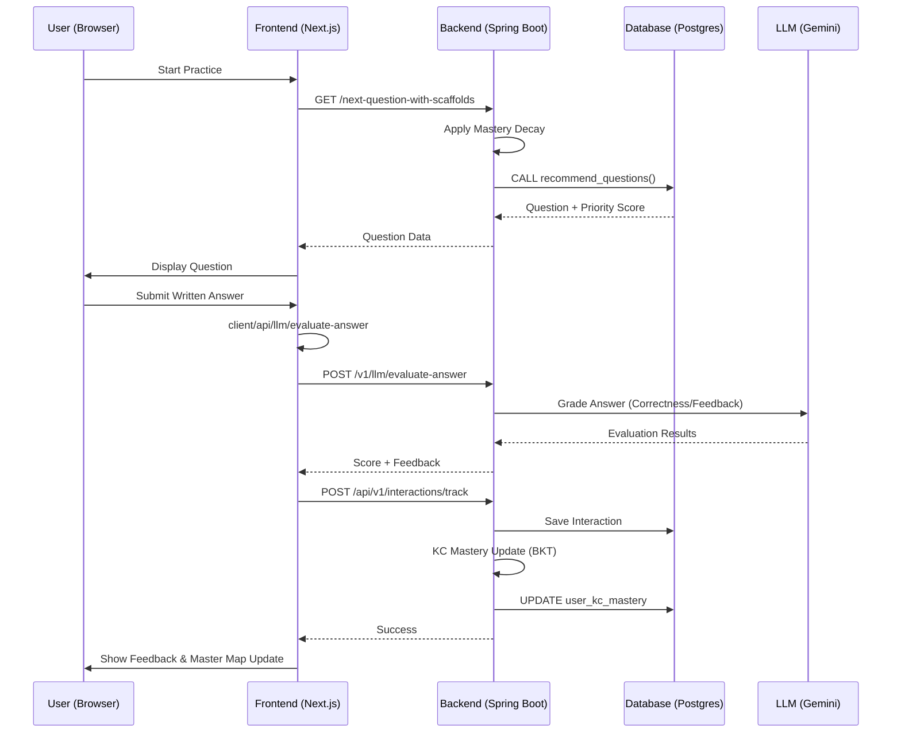

# Practice Session Architecture

This document describes the end-to-end flow of the IntelliCS practice session, from question recommendation to mastery updates.

## 1. Overview Flow

The practice session follows an adaptive learning cycle:
1.  **Recommendation**: Pick the best question based on current mastery and recency.
2.  **Interaction**: Capture user attempts, hints, and scaffolds.
3.  **Evaluation**: Score the answer (LLM-powered for written questions).
4.  **Feedback Loop**: Update student mastery using Bayesian Knowledge Tracing (BKT).

---

## 2. Component Analysis

### A. Frontend Layer
*   **Path**: `client/app/modules/[module_id]/lessons/[lesson_id]/practice`
*   **Controller**: `PracticePageClient.tsx`
*   **State Management**: `useQuestionState` hook (session storage persistence).
*   **Hooks**: 
    *   `useNextQuestionWithScaffolds`: Fetches adaptive questions.
    *   `useInteractionLogger`: Proxies telemetry to the backend.

### B. Backend API Layer (Spring Boot)
*   **QuestionRecommendationController**: 
    *   `GET /api/v1/recommendations/next-question-with-scaffolds`
    *   Calls `QuestionRecommendationService`.
*   **UserInteractionController**:
    *   `POST /api/v1/interactions/track`
    *   Proxies interactions to `UserInteractionService`.
*   **LLMController**:
    *   `POST /api/v1/llm/evaluate-answer`
    *   Uses Gemini API to evaluate written answers for semantic correctness.

---

## 3. Database & Logic Depth

### Mastery Decay (Pre-Practice)
Before every recommendation, the system applies **Mastery Decay** to simulate forgetfulness:
*   **Service**: `MasteryDecayServiceImpl`
*   **Algorithm**: BFS propagation (Depth 2) from lesson KCs to neighbors.
*   **Formula**: $M_{new} = M_{old} \times e^{-(\text{rate} \times \text{impact}) \times \text{days}}$
*   **Threshold**: Grace period of 6 days; decay rate 0.05/day.

### Recommendation Engine
*   **Data Layer**: PostgreSQL function `recommend_questions`.
*   **Priority Score**: 
    $Score = weight \times (\max(0.1, TargetM - PMastery) + RecencyFactor)$
*   **Spaced Repetition**: `RecencyFactor` brings back mastered items after 30 days of inactivity.

### Mastery Modeling (BKT)
Every attempt updates the user's brain model in `user_kc_mastery`:
*   **Service**: `KCMasteryServiceImpl`
*   **Logic**: Bayesian Knowledge Tracing.
*   **Parameters**:
    *   $P(L_0) = 0.25$ (Initial Mastery)
    *   $P(Guess) = 0.20$
    *   $P(Slip) = 0.15$
    *   $P(Transit) = 0.20$
*   **Scaffolding Weight**: Scaffold interactions have a reduced weight ($0.3x$) to account for assistance.

---

## 4. Sequence Diagram

